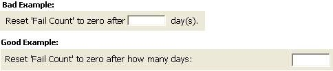
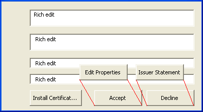

# Internationalization

When working on any software project it is important to think about internationalization from the very beginning of its design.
While you may not choose to translate the user interface for the first iteration or release,
the design and implementation decisions that you make early in the project can make or break rolling out your project into other markets later.

## What makes a feature world ready?

It is important to ensure all our features are world-ready.
What does it take?
At the highest level, it means all features share the following characteristics.

- Unicode enabled, including surrogate pairs
- Local and culturally aware
- Support international standards as appropriate
- Support different input methods, including Input Method Editors (IMEs)
- Complex-script aware, including mirroring
- Font independence (font may be customized by language, support font fallback, etc.)
- Localizable
- Pluggable (MUI Aware)

## Internationalization and the development workflow

Regardless of the coding methodology you use, there is a basic workflow to incorporating world-readiness into your code.

1. **Plan**

   What markets will you release to, now and in the future?
   What are the legal and cultural requirements of those markets?
   Even if you only release in one language, that language may be used by multiple markets.
   Is your code flexible enough to work in those markets?
   Does your entire product experience — order, use, and support — allow business in languages and markets you are targeting?

1. **Develop**

   Code and verify the product can work in multiple markets, without the need for redesign.
   Use internationalization libraries.
   Set up internationalization metrics and adhere to your own standards.
   Ensure the product can be translated when you're ready to release in those markets.
   In an agile world, your code needs to be "done": world-ready by the end of the sprint.
   No separate special effort as you might have seen in other models.

1. **Translate**

   Is the product translatable? Do you have a system to have the product translated?
   Are you using in-house resources or outsourcing?

1. **Iterate**

   Few products are static entities.
   Once you've been through the cycle once, you will need to continue to practice internationalization in all future iterations.

## Designing for internationalization

Coding for world-readiness may have an impact upon implementation across the entire product, most importantly in the user interface design.
Below is a list questions to ask yourself when designing for internationalization.
The reason for this "one size fits all" user interface policy is all about saving time, saving money, and providing the experience the customer expects.

### Market Adaptability

- Does this feature support the targeted audience? For example, if students are a target audience for your feature, how does student life differ in China, Mexico, and the U.S.?

- Will your feature support any country or regional standards or legal requirements that would affect your feature?
  For example, the Chinese government requires any software distributed in the Chinese market to support the [GB18030](https://en.wikipedia.org/wiki/GB_18030) encoding system.

- Can your feature be turned on or off for a given market or language? For example, Japanese users expect personnel information to be presented in a hierarchical manner, by department.
  This may not be appropriate in other markets, so it may make sense to make this feature configurable.

- Does your feature support common practices in key markets? For example, will the feature work in markets where:

  - credit cards are not commonly used? Or where other methods of payment are commonly offered to users in the market?

  - broadband penetration is low and communal computing (kiosks, cafés, etc.) are common?

### Encoding

- Do all components of your feature support Unicode?
  Unicode encompasses virtually all characters used widely in computers today and standardizes encoding schemes to process it efficiently.
  When application components don't support the Unicode standard, they commonly misinterpret text coming from other components, which eventually results in unpredictable consequences ranging from corrupted output text to hangs and crashes.
  Supporting Unicode makes efficient multilingual text processing possible and is the recommended way to support language texts for which there are no code pages (e.g. Hindi).

- Does the feature send or receive data to or from other features, components, or applications?
  For example, Unicode SQL data may be stored as UTF-16, but a web component may use UTF-8.
  How will you handle these different encodings to correctly exchange data with that component?

### Location

- Does the feature work between two people who do not share the same language or culture?
  For example, an Arabic user successfully sends a meeting request to an English recipient without any garbled content.
  Do you need to make machine translation available to translate the content?

- Does the feature work between two people who are not in the same time zone? For example:

  - A co-worker in California sends a meeting request to a co-worker in New York.
    Both co-workers meet at the correct time even though they are in two different time zones.

  - Is latency considered in the scenario? What happens if someone doesn't respond in X amount of time due to time zone differences?

### Internet protocols

- If your feature processes and displays various internet protocols, does it support non-Latin characters such as www.café.com, χρήστη@μηχανή.ελ, http:// مثال.إختبار, or \\\\公司\\单位\\文件.docx.
- Double-encoding is frequently seen when two different components use HTML encoding; instead of "Documents partagés" (Shared Documents) the user sees "Documents partag&\#233;s". The resulting string is not human readable.
- Have you considered the entire process flow?
  - When processing data, host names, URLs/IRIs, UNC paths, or email addresses, when is the conversion happening? What is doing the conversion?
  - Is your feature handing off the information in the format the receiving component is expecting?
  - Is your feature properly encoding and decoding incoming data?

### Text input and display

- If your feature has text, is the font of the text available to all users?
  For example, fonts such as Arial do not support languages such as Chinese, Japanese, and some characters used in Eastern Europe.

- If your feature has text input, can the user enter text via other methods than the keyboard?
For example, Chinese, Japanese, and Korean require special input methods such as Input Method Editors (IMEs) because of the thousands of possible characters in these languages that make one-to-one mappings with keyboard keys difficult.

  - Can the user use input methods other than keyboards to type their text into the application?
    For example: IME, touch, handwriting (for more than English), speech-to-text, etc.

  - If a particular technology is not available for all languages, what will happen for those users?

- Does the control (e.g., RichEdit, .NET, ActiveX, WPF, etc.) support all the [Unicode](http://www.unicode.org/) languages?
  Please note that "support" does not mean the user interface languages, but the languages the user can type into the application.
  Is the functionality consistent across platforms (client, server, mobile)?
  If not, what will you do to expand the support to match the rest of the user's experience in your program?

- Will your document retain its formatting when round-tripping between client, mobile, and Web experiences?
  For example, what happens if a user opens a document on their mobile device?

- Do not assume that Latin word delimiters (such as spaces and commas) are used in all languages.
  For instance, many Asian languages do not support delimiters.
  Thai, for example require a lexicon to determine the end of a word based on dictionary lookups.
  Write and design your word separator functions to have the ability to take a buffer and return a word boundary without assuming delimiters.
  This makes it easier to add code in that function; i.e., lookup a dictionary in Japanese or Thai.
  Line breaking should also consider no-space word delimited languages, and also special requirements such as the Japanese Kinsoku rule.

- Do not assume that each character is represented by one glyph (e.g., graphic representation) on the screen.
  Some languages, such as Thai and Arabic, have representations where two or more characters are represented by one glyph or where one character is represented by multiple glyphs.
  Here is an example: if the h and g keys are typed on an Arabic keyboard then internally one glyph representing the combined characters would appear.
  The characters ل and ا will show up as لا.
  You will notice that to cursor through the glyph takes two steps.
  This may impact features such as character counting, justification, character width calculation, line breaking, cursor movement, and selection.

- If your feature has shortcut keys or accelerators, do the key-combinations vary by different keyboard languages?
  For example, in some European languages, some characters can only be typed when you type the Alternate Graphics (AltGr) key first, which maps to the "Alt+Ctrl" sequence.
  If the feature has a shortcut key identical to "Alt+Ctrl", then the user will never be able to type those characters because it conflicts with the feature's shortcut key.

### Locale support

It is best to use common APIs, such NLS, .NET, or ICU to address the following issues.

- If your feature uses date/time formats, a calendar, or a calendar control, does it allow usage of different calendar types? For example:

  - If your feature displays date or time, does it allow different date or time format ordering?
    For example, Japanese dates are often in the order of era, year, month, and date (平成 22年 12月 05日).

  - Consider how different calendars may impact all your features.
    Does your month picker support the 13 months found in the Hebrew Lunar calendar during a leap year?
    In addition, weekdays are not always Monday through Friday. Many countries use Saturday as the first day of the week.

- If your feature displays numbers, does it allow different number formats? For example:

  - The default setting for the German locale is the period (.) to separate number groups and the comma (,) to show fractions, as in 1.234,56.

  - Turkish people place the percentage symbol (%) on the left side of a number (%20).

  - Does your feature display, input, send, receive, save or load whole numbers, decimals, percentages, negative numbers, or non-ASCII numbers (e.g., ١,٢, ๒, ๓, etc.)?

  - Does the feature allow the user to format numbers as currency?
    Does it display, input, send or receive, and save or load currency numbers?
    For example, Bahrain uses three decimal places in their currency format (د.ب.‏1,234.456), if you hard-code the decimal places to two places your feature will not meet the user's expectations.

  - If your feature sorts a range of data, can the user specify the correct sort order that matches their cultural expectations?
    For example, in Norwegian, the "ø" character is sorted after "z".
    If a user asks for a range of data of h-q, they would be surprised to see items starting with the ø character in their results.
    Each language sorts uniquely, and some cultures define more than one sort order for their language.

- If your feature displays proper names including honorifics, do you allow for ruby text or phonetic guides? Are you addressing the user in the level of formality appropriate to that culture and the context?

- If your feature displays addresses, telephone numbers, or phone numbers, can the format and ordering be changed?
  For example, a Korean phone number has nine digits and the prefix can be either three or four digits, and the area code can be either two or three digits, (02) 531-4500.

- If your feature allows printing, can the user configure the paper size to local standards?
- Does it include A, B, C-series, or other formats for special purposes?
  If your feature allows printing, will all the content correctly preview and print as it was displayed on the screen?
  Did you consider all fields, comments, signatures, margins, headers, footers, and page breaks?

### User interface

User interface is not limited to a graphical user interface, but also includes error messages, logs, and console input and output.

- Are you using Global English? It is recommended to use simple, easy to understand English for users around the world and for those who are using English as a second or third language.
  Additionally, this will make your strings easier (and cheaper) to translate.

- If your feature has UI strings, are all the strings available to be translated? For example, all UI is required to be translated by the [Toubon Law](http://en.wikipedia.org/wiki/Toubon_Law#Provisions_of_the_law) in France and the [Quebec Law 101](http://en.wikipedia.org/wiki/Bilingualism_in_Canada) in Canada.

- Does the feature incorporate components that are not translated for your target markets? How will you handle unsupported markets? What are the ramifications, fall back mechanisms, etc.?

- If your feature has UI elements that combine to form a sentence, can the UI be reordered?
  For example, the recurrence dialog in the calendar is problematic and adds complexity to localization because the ordering of the sentence doesn't make sense in non-English languages.

    

- If your feature has images that contain text that requires translation, can you use a different image instead?
  Image translation adds complexity and extra cost to the localization process.
  It is recommended to create generic images or icons that work for all languages.
   English versus
   Arabic

- If your feature has user interface elements, can they be designed to dynamically expand for other languages?
  For example, a date navigator shows days of the week abbreviated with two letters for English (Su, Mo, Tu) and expands to three-letter abbreviations for Turkish.
  Keep in mind that text may expand vertically _and_ horizontally.
  Allow for text to expand horizontally. The length of words will increase in some languages, such as German, Finnish, and Czech.
  But also design for text to increase vertically.
  Some scripts have tall risers and descenders or accent characters that will expand beyond typical English or Latin script text.

- Clipping and truncation can change meaning in profound or offensive ways.
  Ensure you understand how the meaning can be changed if you clip part of the word, either horizontally or vertically.
  Removing an accent can change the meaning of a word: probably to something you didn't intend!

- Does your feature have dialogs that contain elements that display content dynamically?
  For example, these controls are difficult to localize, especially if these controls require resizing and/or relocation.
  There is often no way for the translator to know which elements will display together.
  
  

- Can all the components of the feature be mirrored for languages that are written right-to-left (RTL), such as animation, shadows, tree control, or tab order?
  For example, Hebrew users type from right to left and have a right to left workflow.
  They have a poor experience when panes in the modules are not mirrored consistently.
  The navigation pane is mirrored correctly, but the message list is not.
  As a result, the message list and navigation pane scroll bars are side-by-side, making it difficult for the user to pick the correct scroll bar to use.

- Italic, bold, and underline are not universal for all scripts or locales.
  Some fonts may not even have an italic form.
  Consider the impact to your design if you need to use other method to differentiate text or allow alternate emphasis methods for non-Latin text.

- Capitalization can matter, or is not applicable depending on language.

  - Using all lower-case is not linguistically appropriate in all languages.
    For example, automatic un-capitalization for German would lead to grammatically incorrect sentences: certain types of words, like nouns, names, gerunds, must start with upper case.

  - Using all upper-case may not provide a design change for scripts that have no casing.
    Ensure automatic capitalization is using the correct rules or the meaning of the word could be changed (Turkish and Greek are particularly problematic).

- Color can add cultural meaning; understand the context.
  There is no color that needs to be avoided in every case.
  More important is to ensure you are aware of meanings in various contexts.
  In some cases, your choice of color may have unintended interpretations.
  The [International Color Guide](http://www.office.xerox.com/small-business/tips/color-guide/enus.html) has more information.
