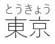
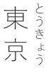
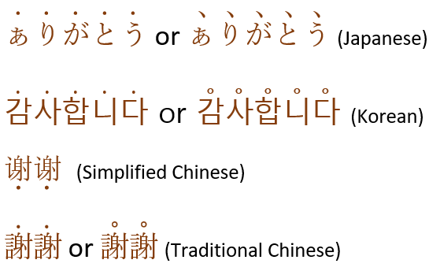
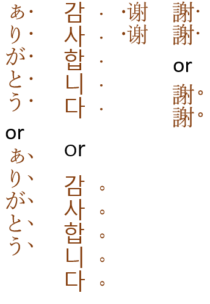
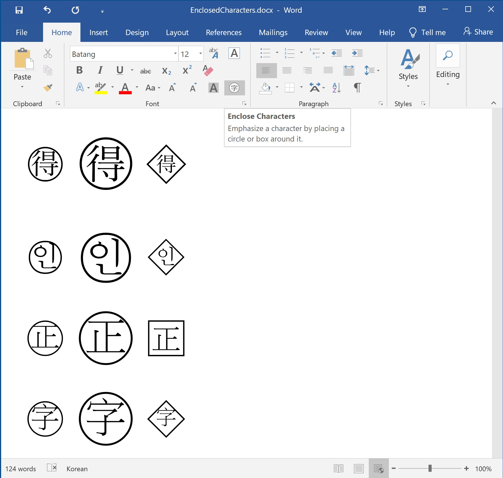

# Overlay text properties

The remaining category of advanced text properties relates to text overlay.
These properties apply not just to the glyph, but to an entire text string.

## Phonetic guides, yomi, furigana, or "ruby" text

The terms _phonetic guide_, _yomi_, _furigana_, or _ruby_ are used somewhat interchangeably to refer to an annotative gloss placed above or to the right of characters to aid the user in pronunciation.
The terms *yomi* and *furigana* are only used in a Japanese context.
This is particularly important for logographic languages where the reader may not be familiar with a character or the character has more than one pronunciation.

**Figure 1:** The word "Tokyo" with phonetic spelling in horizontal layout

**Figure 2:** The word "Tokyo" with phonetic spelling in vertical layout

The Worldwide Web Consortium [defines three levels of ruby support](https://www.w3.org/TR/jlreq/): mono ruby, group ruby, and jukugo ruby.

## Emphasizing text

Due to the nature of the characters used by East Asian languages, bolding often makes the characters unreadable.
Therefore, emphasis points are used to emphasize certain text.
Note that Simplified Chinese differs in that the emphasis mark is to the left of or below the text, instead of to the right or above the character.

Other methods to emphasis text include underlining, or "side line" if the text is written vertically, and the use of brackets (〈〉《》「」『』【】〔〕〖〗〘〙〚〛).
Brackets may be used both vertically and horizontally.

Emphasis mark are not supported in HTML.
Attempting to save documents containing emphasis marks may result in conversion to underline for the alternative "emphasizing" effect.

**Figure 3:** Emphasis marks on horizontal text.

**Figure 4:** Emphasis marks on vertical text.

## Enclosed Characters

Enclosed characters are characters surrounded by equilateral shapes such as triangle, square, diamond or circle - commonly used in East Asia to indicate symbols.
Enclosed characters are not supported in HTML; attempting to save documents with enclosed characters may result in removing the enclosing effects and leaving the base character.

**Figure 5:** Example of enclosed characters
