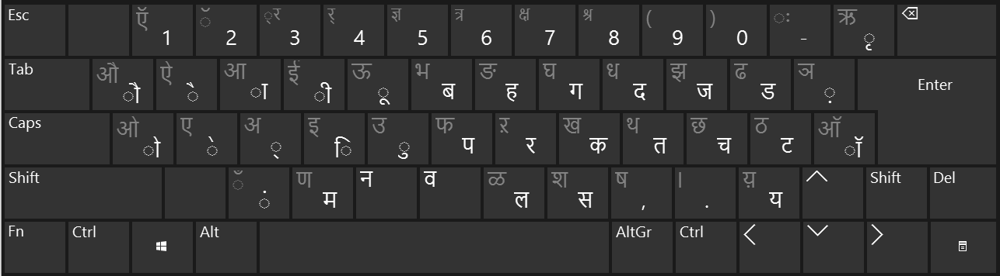

# Text input, output, and display

On the surface, the input, output, and display of data is a simple process-the user enters data with a keyboard (or perhaps with a voice-recognition or handwriting-recognition engine), and the program displays that data using a selected font.
This assessment of the process, however, assumes that each user is monolingual.
What if a user tries to enter data in several different languages?
In this case, the process becomes much more complicated.

Different languages have different keyboard layouts, and the characters of each language might fall into different character sets that require separate fonts.
With all these challenges in mind, Microsoft Windows supports standard mechanisms for multilingual data input, output, and display.
This section covers the many ways to handle each of these areas.

## Ensure that the application is fully Unicode enabled

Do not assume user data will only be entered in your script; software should be [Unicode enabled](../encoding/encoding-overview.md).
Users should also be able to use extended characters in all parts of your product, such as in:

- document text,
- file names,
- directories,
- server names,
- user names, and
- generally, all text strings used in any way throughout your product.

## Keyboards, other input methods, and text prediction

If you are using a standard control, you should have no need to worry about the user’s input method.
This will be handled for you automatically.
Advanced applications (such as a text editor) will require significant development to handle keyboard and input language changes, IME messages, bi-directional scripts, and other text-handling concerns.

See [Using Keyboard Input](/windows/win32/inputdev/using-keyboard-input) for detailed information on handling keyboard input in Windows.

The exception may be for keyboard shortcuts. If you define a shortcut as Alt-S and there is no S on the keyboard, what does that mean for the user?

**Figure 1:** Hindi Traditional Keyboard

### Enable Input Method Editors (IMEs) and text prediction

For some languages, the number of characters needed for writing the language is greater than the number of keys on a standard keyboard (Chinese, for example).
For others, the complexity of the writing system itself means that a model of one key equating to one character will not work well (Malayalam, for example).
To allow users to write in such languages, Input Method Editor (IME) applets have been created for each language.
These are provided by the platform or available through third-party vendors.
In some cases, multiple IMEs are available for the same language.

For languages with extremely large character sets, the IME presents a candidate window based on the text entry.
The candidates usually have a one-to-many relationship to the text typed.
There are two basic models within this category.
The first is used for languages such as Japanese where there exist defined phonetic systems (hiragana and katakana) that can be used to enter most words.
The conversion is from the phonetic forms to the more formal kanji.
The second is where there is not a phonetic system within the language, so transliteration using the Latin script is used.
An example of this is the pīnyīn system used for Chinese.
Technically, any simple writing system language could be used, but the Latin script and keyboard is most common.
For both systems, the user enters text in a phonetic form and can then select the final character(s) they want.
That input is converted to a list of potential candidates for the final characters and the user selects the desired text.
Once the final text is selected, that text is sent to the input stream.

IMEs are also relevant for improved text entry, particularly on touch devices such as mobile phones.
The IME logic is what allows for text prediction, even for languages with a simple character-to-key model.
The candidate list is based on prediction rather than phonetics and is not required to input text into the text stream.
The IME model is also what underlies the press-and-hold experience that allows a single key on a touch keyboard to have numerous alternate characters.

When implementing IME support, the developer should consider the following:

- The string composition, candidate selection, and input all occur at the input position.

- The number of key events will likely not equal the number of characters displayed.

- For fields such as passwords, it is recommended that the IME candidate model not be used as it makes observing the password easier and, perhaps more critically, the representation of the password length is ambiguous.

- What happens when the program receives events (such as a Close event) while text is in undetermined state?

- What happens when the user triggers a shortcut associated with the IME (hits ESC, for example)?

- Maximum character limits (whether byte based or visually based) are more complex with IME input.
  A common problem case for this is entering text in fields with character length limits – does the limit apply to the text as entered or text as displayed?
  For complex writing systems, the number of key events may be greater than the final candidate length.
  For text prediction, the user might select a predicted word that exceeds the limit.
