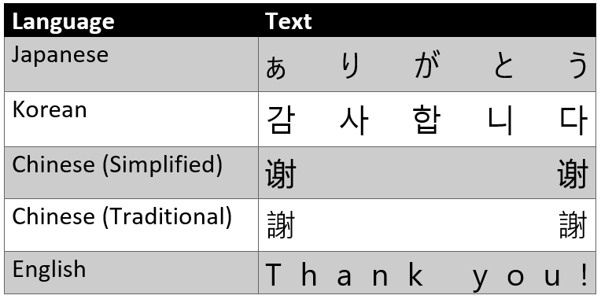
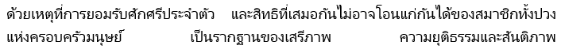
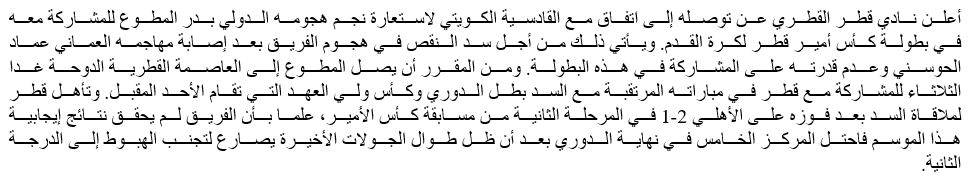

# Text justification

Some scripts or cultures have special rules about how text is justified.
Justification refers to how the text aligns with the margins of an object.
The object to be aligned with can be a page, a column, a table, a shape, and so on.

## Justification within a table

For East Asian language, the first and last characters of each line (except the last) are aligned to the left and right margins, and lines are filled by adding or subtracting space between and within words.
This is also called distributed alignment: A formatting setting that spreads text evenly, both vertically and horizontally, between the edges of a cell, object, or page.

## Thai text justification

The main difference between Thai text justification and English justification is that Thai places space between clusters while English distributes space between words.

Thai text _with_ distributed justification

Thai text _without_ distributed justification

## Kashida justification

Kashida is character elongation used in Arabic to increase the length of the line connecting to characters.
It does not affect the sound or the meaning of the word.
It is also used in text justification instead of whitespace.
Note that there may be multiple kashidas.

Arabic text _with_ kashida justification:

Arabic text _without_ kashida justification:

