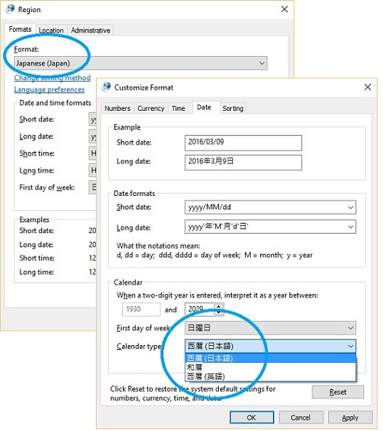

# World calendars

The Gregorian calendar is used in most English speaking countries and regions, but world-ready products should also take into consideration other calendar systems in use worldwide.
For example, there are the Japanese, the Buddhist era, the Hijri, the Hebrew lunar, the Taiwan calendar. and more.
One of the major differences between calendars is that each calendar could have a different year value.
For example, the Gregorian year 2016 is the twenty-eighth year in the Japanese Heisei era and the year 1437 in the Hijri calendar.
The first day of the year might not be January 1 as in the Gregorian calendar.
The Chinese New Year was on February 8 of the Gregorian year 2016.

The length of the year and months vary, as well as various ways to handle leap years.
Within the same calendar, the first day of the week may differ depending on the culture.
For instance, in most of Europe that uses the Gregorian calendar, the start of the week is Monday.

Sometimes more than one calendar system is used in the same locale, such as Japanese.

**Figure 1.** Available calendar types for Japanese regional setting

An application should allow the user to choose the calendar and date format.

More information:

- [Handling calendars in Win32](handling-calendars-in-win32.md)
- [Handling calendars in .NET Framework](handling-calendars-in-dotnet-framework.md)
