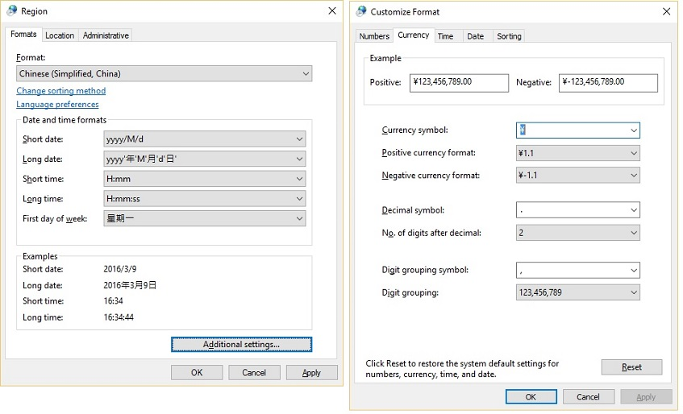

# Currency formatting

Currency formatting needs to take into consideration these following locale-sensitive elements:

- **Currency symbol** — This can be a pre-defined symbol such as the European Euro '€' or a combination of letters like the use of 'GBP' for British Pound.

- **Currency symbol placement** — It can be either place before or after the digits.

- **Negative-amounts** — Several of the ways to display negative amounts are:

| Description | Country/Region | Formatting |
|---|---|---|
| The negative sign before both the currency symbol and number.         | UK            | -£127.54 |
|                                                                       | France        | -127,54 € |
| The negative sign before the number but behind the currency symbol.   | Denmark       | kr-127,54 |
| The negative sign after the number.                                   | Netherlands   | € 127,54- |
| Enclosed in parentheses.                                              | US            | (\$127.54) |

Most currencies use the same decimal and thousands separator that other numbers in the locale use, but this is not always true.
In some places in Switzerland, they use the period as a decimal separator for Swiss francs (Sfr. 127.54), but then use commas as the decimal separator everywhere else (127,54).

To see the currency formatting options in Windows, choose Additional Settings from the Region settings page, as shown in FIgure 1 below.

**Figure 1:** Currency format in Windows Region settings

**More information:**

- [Currency Formatting in Win32](currency-formatting-in-win32.md)

- [Currency Formatting in .NET Framework](currency-formatting-in-the-dotnet-framework.md)