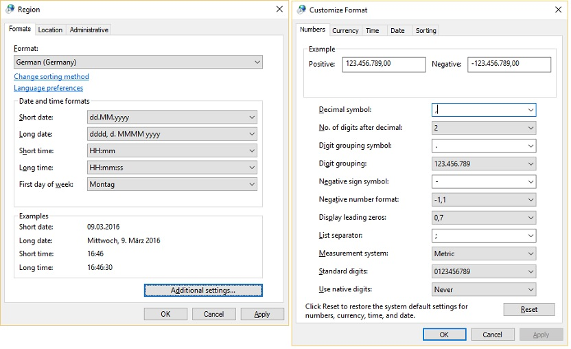

# Number formatting

When dealing with numeric values, there are several major items to pay attention to:

## Are the values currency (monetary) values?

Currencies require separate treatment from other numeric values.
See [Currency formatting](currency-formatting.md) for details.

## The character used as the thousands separator

In the United States, this character is a comma (,).
In Germany, it is a period (.).
Thus one thousand and twenty-five is displayed as 1,025 in the United States and 1.025 in Germany.
In Sweden, the thousands separator is a space.

## The character used as the decimal separator

In the United States, this character is a period (.).
In Germany, it is a comma (,).
Thus one thousand twenty-five and seven tenths is displayed as 1,025.7 in the United States and 1.025,7 in Germany.

## The way negative numbers are displayed

The negative sign can be used at the beginning of the number, but it can also be used at the end of the number.
Alternatively, the number can be displayed with parentheses around it or even in a color such as red.
Thus a negative five hundred and twenty-seven could be displayed as:  

- -527

- 527-

- (527)

- [527]

## The shape of the numbers and representation of the number 10

Numbers might, of course, be shaped differently from one locale to another.
Also, numbers in some locales might not correspond directly to there digits (0-9) used in, say, the United States. (See Table 1 below)

| Script | Digits used |
| -- | -- |
| Latin                             | 0 1 2 3 4 5 6 7 8 9               |
| Arabic                            | ٠‎ ١‎ ٢‎ ٣‎ ٤‎ ٥‎ ٦‎ ٧‎ ٨‎ ٩ |
| Chinese / Japanese                | 〇 一 二 三 四 五 六 七 八 九 十… |
| Hebrew                            |  א ,ב ,ג, ד, ה, ו, ז, ח ,ט… |
| Korean                            | 일 이 삼 사 오 육 칠 팔 구… |
| Korean                            | 하나 둘 셋 넷 다섯 여섯 일곱 여덟 아홉…. |
| Bengla                            | ০ ১ ২ ৩ ৪ ৫ ৬ ৭ ৮ ৯ |
| Devanagari (script used to write Hindi,Marathi, and other languages)| ० १ २ ३ ४ ५ ६ ७ ८ ९ |
| Gujarati                          | ૦ ૧ ૨ ૩ ૪ ૫ ૬ ૭ ૮ ૯ |
| Gurmukhi (one of the scripts used to write Punjabi) | ੦ ੧ ੨ ੩ ੪ ੫ ੬ ੭ ੮ ੯ |
| Kannada                           | ೦ ೧ ೨ ೩ ೪ ೫ ೬ ೭ ೮ ೯ |
| Malayalam                         | ൦ ൧ ൨ ൩ ൪ ൫ ൬ ൭ ൮ ൯ |
| Odia                              | ୦ ୧ ୨ ୩ ୪ ୫ ୬ ୭ ୮ ୯ |
| Tamil                             | ௦ ௧ ௨ ௩ ௪ ௫ ௬ ௭ ௮ ௯ |
| Telugu                            | ౦ ౧ ౨ ౩ ౪ ౫ ౬ ౭ ౮ ౯ |
| Thai                              | ๐ ๑ ๒ ๓ ๔ ๕ ๖ ๗ ๘ ๙ |
| Tibetan                           | ༠ ༡ ༢ ༣ ༤ ༥ ༦ ༧ ༨ ༩ |

**Table 1**: Digits used for a variety of scripts.

Note how some scripts have one more digit than Latin or Arabic.
This 'extra digit' represents the number 10.

Korean regularly uses both a Sino-Korean system and a native Korean system. Everything that can be counted will use one of the two systems, but seldom both.

## Digit grouping

This refers to the number of digits contained between each separator for all digit groups that appear to the left of the decimal separator.
For example, the 3-digit group is used for most cultures, such as for English (United States): 123,456,789.00.
However, notice that Hindi uses a 2-digit grouping, except for the 3-digit grouping for denoting hundreds: 12,34,56,789.00

## The placement of the percent sign (%)

It can be written several ways: 98%, 98 %, 98 pct, %98.
Thus you should never assume that you can hard-code the percent sign.

The user can define preferred number-formatting parameters by making selections from the Numbers tab of the Customize Regional Options property sheet, within the Regional And Language Options property sheet. (See Figure 1 below.)

**Figure 1:** Selecting the preferred number formatting

In addition to in-line numbers, there may be additional systems used for [numbered lists](https://support.office.com/article/Create-a-bulleted-or-numbered-list-9ff81241-58a8-4d88-8d8c-acab3006a23e).
Examples include Roman numerals for many locales and Iroha for Japan.

## More information

- [Number Formatting in Win32](number-formatting-in-win32.md)

- [Number Formatting in .NET Framework](number-formatting-in-dotnet-framework.md)
