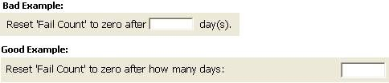

# International design

When working on any software project, it's important to think about internationalization from the very beginning of its design.
Your first iteration or release may not be translated into another language, but the decisions that you make early in the project can determine your ability to deliver to other markets later.
Coding for world-readiness affects implementation across the entire product.
The user interface design is the most affected, but globalization must be considered in many other areas as well.

A universal policy to consider globalization is all about saving time and money, and providing the experience customers expect.
World-readiness should be examined for every component of an application.

This article can be considered a check-list of points to cover when reviewing world-readiness.

## What makes a feature world ready?

It's important to ensure all our features are world-ready.
At the highest level, it means all features share the following characteristics.

* Unicode enabled, including surrogate pairs.
* Text data is stored and processed as Unicode.
* Data is stored in a universal form or stored with pertinent metadata. It may be important to record a time zone, unit of measurement, or monetary unit.
* Aware of locale and culture.
* Support international standards as appropriate.
* Support different input methods, including Input Method Editors (IMEs).
* Complex-script aware, including mirroring of the user interface and bidirectional text layout.
* Font independence (font may be customized by language, support font fallback, and so on).
* Localizable.
* New languages can be plugged in by distributing satellite resources, without changing any code.

## Internationalization and the development workflow

Regardless of the coding methodology you use, there's a basic workflow to incorporating world-readiness into your code.

1. **Plan**

   * What markets will you release to, now and in the future?

   * What are the legal and cultural requirements of those markets?

   * Even if you only release in one language, that language may be used in multiple markets.

   * Is your code flexible enough to work in those markets?

   * Does your entire product experience allow business in languages and markets you're targeting?
     Consider the whole customer experience: try, buy, deploy, use, support, and update.

1. **Develop**

   * Code and verify the product works in multiple languages and locales, without the need for redesign.

   * Use internationalization libraries. Don't create your own.

   * Set up international metrics and adhere to your own standards.

   * Ensure the product can be translated so that you’re ready to release in new markets.
     You can use pseudo-translation to prove localizability.

   * With rapid development, your code needs to be “done”: world-ready by the end of the sprint.

   * No separate special effort as you might have seen in other models.

1. **Translate**

   * Is the product translatable?

   * Do you have a system to have the product translated?

   * Are you using in-house resources or outsourcing?

1. **Iterate**

   * Few products are static entities.
     Once you’ve been through the cycle once, you'll need to continue to practice internationalization in all future iterations.

## Market Adaptability

Here a list questions to ask yourself when designing for internationalization:

* Does this feature support the targeted audience?
  For example, if students are a target audience for your feature, how does student life differ in China, Mexico, and the US?

* Will your feature support any country or regional standards or legal requirements that would affect your feature?
  For example, the Chinese government requires any software distributed in China to support the [GB18030](https://en.wikipedia.org/wiki/GB_18030) encoding system.

* Can your feature be turned on or off for a given market or language?
  For example, Japanese users expect personnel information to be presented in a hierarchical manner, by department.
  A flat presentation may be more appropriate in other markets, so it may make sense to make this feature configurable.

* Does your feature support common practices in key markets?
  For example, will the feature work in markets where:

  * credit cards aren't commonly used, or where other methods of payment are commonly offered to users in the market?

  * broadband penetration is low and communal computing (kiosks, cafés, etc.) are common?

## Encoding

* Do all components of your feature support Unicode?

  Unicode encompasses virtually all characters used widely in computers today and standardizes several encoding schemes to process it efficiently.
  A component that doesn't support Unicode commonly misinterprets text coming from other components.
  An encoding mismatch eventually results in unpredictable consequences ranging from corrupted data to hangs and crashes.
  Supporting Unicode makes efficient multilingual text processing possible and is the only way to support languages without a code page, such as Hindi.

* Does the feature send or receive data to or from other features, components, or applications?

  For example, Unicode SQL data may be stored as UTF-16, but a web component may use UTF-8.
  How will you handle these different encodings to correctly exchange data?

## Location

* Does the feature work between two people who don't share the same language or culture?

  For example, an Arabic user successfully sends a meeting request to an English recipient without any garbled content.
  Do you need to make machine translation available to translate the content?

* Does the feature work between two people who aren't in the same time zone? For example:

  * A co-worker in California sends a meeting request to a co-worker in Paris.
    Both co-workers meet at the correct time even though they are in different time zones.

  * Is latency considered in the scenario? What happens if someone doesn't respond in X amount of time due to time zone differences?

## Internet protocols

* If your feature processes and displays various internet protocols or paths, does it support international characters such as in **:::no-loc text="www.café.com":::**, ***:::no-loc text="χρήστη@μηχανή.ελ*":::**, **:::no-loc text="http:// مثال.إختبار":::**, or **:::no-loc text="\\\\>公司\\单位\\文件.docx":::**.

* Double-encoding is a frequently seen defect when two components use HTML- or URL-encoding.
  Instead of ":::no-loc text="Documents partagés":::" (Shared Documents) the user sees ":::no-loc text="Documents partag&\#233;s":::".
  The resulting string isn't human readable.

* Have you considered the entire process flow?

  * When the component processes data, host names, URLs/IRIs, UNC paths, or email addresses, when is the conversion happening?
    What component is responsible for the conversion?

  * Is your feature handing off the information in the format and encoding that the receiving component is expecting?

  * Is your feature properly encoding and decoding incoming data?

## Text input and display

* If your feature has text, is the font of the text available to all users?

  For example, fonts such as Arial don't support languages such as Chinese, Japanese, and some characters used in Eastern Europe.

* If your feature has text input, can the user enter text via other methods than the keyboard?

  For example, Chinese, Japanese, and Korean require Input Method Editors (IMEs) because of the thousands of characters in these languages.

  * Can the user use input methods other than keyboards to type their text into the application?
    For example: IME, touch, handwriting for more than the source language, speech-to-text, etc.

  * If a particular technology isn't available for all languages, what will happen for those users?

* Does a user interface control support all the [Unicode](http://www.unicode.org/) languages?

  Here we mean the languages the user can type into the application, and not just the user interface language.

* Is the functionality consistent across platforms (client, server, mobile)?
  If not, what will you do to expand the support to match the rest of the user’s experience in your program?

* Will your document retain its formatting when round-tripping between client, mobile, and Web experiences?
  For example, what happens if a user opens a document on their mobile device?

* Don't assume that Latin word delimiters (such as spaces and commas) are used in all languages.

  Many Asian languages don't use word delimiters.
  Thai requires a dictionary to determine the end of a word.

  Instead of in-line text parsing code, use a shared function that takes a segment of text and returns the word boundaries.
  A separate segmentation function makes it easier to add code in just that function to do what is necessary for your supported languages.
  Line breaking should also consider non-space-delimited languages and special requirements such as the Japanese kinsoku rule.

* Don't assume that each character is represented by one glyph on the screen.

  Some languages such as Thai and Arabic have representations where two or more characters are represented by one glyph.
  Occasionally, one character is represented by multiple glyphs.
  Here's an example: if the h and g keys are typed on an Arabic keyboard then internally one glyph representing the combined characters is displayed.
  The characters ل and ا will show up as لا.
  You'll notice that to cursor through the glyph takes two steps.

  Proper handling of text boundaries can affect features such as:

  * character counting
  * word counting
  * justification
  * character and line width calculation
  * line breaking
  * cursor movement
  * selection

* If your feature has shortcut keys or accelerators, do the key combinations vary by different keyboard languages?

  For example, in some European languages, some characters are typed with a sequence of AltGr then another key. AltGr (Alternate Graphics) maps to Alt+Ctrl.
  If a shortcut key is Alt+Ctrl+*key*, then the user will never be able to type those characters.

## Locale support

Whenever possible, use existing locale APIs such Windows NLS, .NET, or ICU.
Creating your own globalization methods can require extensive research and development, and may require local domain expertise.
If you do find a need for a custom implementation, consider using the Common Locale Data Repository (CLDR) as a source of locale data.
The CLDR is developed by local domain experts across the world.

* If your feature uses date and time, a calendar, or a calendar control, does it allow usage of different calendar types? For example:

  * If your feature displays date or time, does it allow different date or time format ordering?
    For example, Japanese dates are often in the order of era, year, month, and date (:::no-loc text="平成 22年 12月 05日":::).

  * Consider how different calendars may affect your features.
    Does your month picker support the 13 months found in the Hebrew Lunar calendar during a leap year?
    Weekdays aren't always Monday through Friday. Many countries use Saturday as the first day of the week.

* If your feature displays numbers, does it allow different number formats? For example:

  * The default setting for the German locale is the period (.) to separate number groups and the comma (,) to show fractions, as in 1.234,56.

  * Turkish people place the percentage symbol (%) on the left side of a number (%20).

* Does your feature display, input, send, receive, save or load whole numbers, decimals, percentages, negative numbers, or numbers using digits other than 0-9?

  Here's a sample of digits from other locales:
:::no-loc text="&#x0661;":::,
:::no-loc text="&#x0662;":::,
:::no-loc text="&#x0663;":::,
:::no-loc text="&#x07C1;":::,
:::no-loc text="&#x07C2;":::,
:::no-loc text="&#x07C3;":::,
:::no-loc text="&#x0967;":::,
:::no-loc text="&#x0968;":::,
:::no-loc text="&#x0969;":::,
:::no-loc text="&#x0BE7;":::,
:::no-loc text="&#x0BE8;":::,
:::no-loc text="&#x0BE9;":::,
:::no-loc text="๒":::,
:::no-loc text="๓":::

* Does the feature display, input, send or receive, and save or load numbers as currency?

  Bahrain, for example, uses three decimal places in their currency format (**:::no-loc text="د.ب.‏1,234.456":::**).
  If you hard-code the decimal to two places, your feature won't meet user expectations.

* If your feature sorts a range of text, can the user specify the correct sort order that matches their cultural expectations for that data?

  For example, in Norwegian, the “ø” character is sorted after “z”.
  If a user asks for a range of data of h-q, they would be surprised to see items starting with the ø character in their results.
  Each language sorts uniquely, and some cultures define more than one sort order for their language.
  Sorting by character code (ordinal) usually doesn't meet user expectations.

* If your feature displays proper names including honorifics, do you allow for ruby text or phonetic guides?
  Are you addressing the user in the level of formality appropriate to that culture and the context?

* If your feature displays addresses, telephone numbers, or phone numbers, can the format and ordering be changed?

  For example, a Korean phone number has nine digits. The prefix can be either three or four digits. And the area code can be either two or three digits, for example: (02) 531-4500.

* If your feature allows printing, can the user configure the paper size to local standards?

  * Does it include A, B, C-series, or other formats for special purposes?

  * If your feature allows printing, will all the content correctly preview and print as it was displayed on the screen?

  * Did you consider all fields, comments, signatures, margins, headers, footers, and page breaks?

  * If you support mirrored languages (RTL), are your print features suitably enabled?

## User interface

User interface isn't limited to a graphical user interface, but also includes error messages, logs, and console input and output.

* Are you using Global English?
  Use simple, easy to understand English for users around the world.
  Consider people who have English as a second or third language.
  A side benefit of using simple English is that your content is easier and cheaper to translate.

* If your feature has UI strings, are all the strings available to be translated?

  All UI is required to be available in French for products marketed in France and both French and English for products marketed in Canada.
  See the [:::no-loc text="Toubon"::: Law](http://en.wikipedia.org/wiki/Toubon_Law#Provisions_of_the_law) for France and the [Quebec Law 101](http://en.wikipedia.org/wiki/Bilingualism_in_Canada) for Canada.

* Does the feature incorporate components that aren't translated for your target markets?

  How will you handle unsupported markets? What are the ramifications, and fall back mechanisms?

* If your feature has UI elements that combine to form a sentence, can the UI be reordered?
  For example, the recurrence dialog in the calendar below is problematic.
  The order does not make sense in some languages.

  

* If your feature has images that contain text that requires translation, can you use a generic image instead?

  Image translation adds complexity and extra cost to the localization process.
  It's recommended to create generic images or icons that work for all languages.
  Consider:
   English and
   Arabic

* If your feature has user interface elements, can they be designed to dynamically expand for other languages?

  For example, a date navigator shows days of the week abbreviated with two letters for English (Su, Mo, Tu) and expands to three-letter abbreviations for Turkish.
  Keep in mind that text may expand both vertically and horizontally.
  Allow for text to expand horizontally.
  The length of words will increase in some languages, such as German, Finnish, and Czech.
  But also design for text to increase vertically.
  Some scripts have tall risers and descenders or accent characters that will expand beyond typical English or Latin script text.

* Clipping and truncation can change meaning in profound or offensive ways.
  Ensure you understand how the meaning can be changed if you clip part of a word, either horizontally or vertically.
  Removing an accent can change the meaning of a word: probably to something you didn’t intend!

* Does your feature have dialogs that contain elements that show and hide content or controls dynamically?

  These controls are difficult to localize, especially if these controls require moving or resizing.
  There's often no way for the translator to know which elements will display together, and where they'll appear.
  It may be a better option to define multiple static dialog templates.
  
* Can all the components of the feature be mirrored for languages that are written right-to-left (RTL)? Consider animation, shadows, tree controls, and tab order.

  For example, Hebrew users type from right to left and have a right to left workflow.
  They have a poor experience when panes in the modules aren't mirrored consistently.
  Consider when a navigation pane is mirrored correctly, but a message list next to it's not.
  As a result, the message list and navigation pane scroll bars are side-by-side, making it difficult for the user to pick the correct scroll bar to use.

* The use of italic, bold, and underline aren't universal for all scripts or locales.
  Some scripts or fonts don't have an italic form.
  Consider the effect on your design if you need to use other methods to differentiate or emphasize text.

* Capitalization can matter, or isn't applicable, depending on language and script.

  * Using all lower-case isn't linguistically appropriate in all languages.
    For example, automatic lower-casing for German would lead to grammatically incorrect sentences. Nouns, names, and gerunds must start with upper case.

  * Transforming to all upper-case may not provide a visual change for scripts that have no letter case.
    Ensure automatic capitalization is using the correct rules or the meaning of the word could be changed. Turkish and Greek are sensitive to changes in case.

* Color can add cultural meaning; understand the context.
  There's no color that needs to be avoided in every case.
  More important is to ensure you're aware of meanings in various contexts.
  In some cases, your choice of color may have unintended interpretations.
  The [Xerox International Color Guide](http://www.office.xerox.com/small-business/tips/color-guide/enus.html) has more information.
