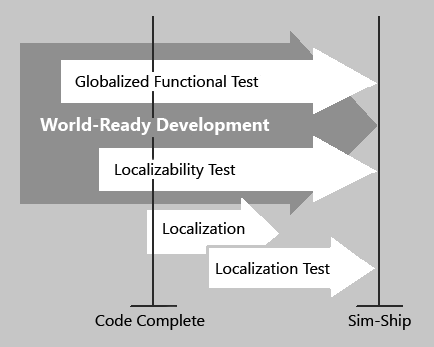

# A world-ready approach to testing

Single code-base design, unified data-processing algorithms, and elimination of functionality problems because of localization are some of the benefits of software globalization.
Globalizing a product and its tests can reduce the redundancy in test runs on the localized product and help make simultaneous release possible.

The old approach to international testing was extensive and often inefficient, as was international software development.
If you wanted to double the number of supported languages or locales, you could end up doubling the resources spent on development and testing.
Even if the settings for certain locales were similar, you couldn't assume the application would work for one locale just because it worked for another.

You can make testing easier and more efficient by globalizing the functional tests.
Once you've verified that the application is globalized, you know that it supports any locale and any language.

See [International design](../mothodology/international-design.md).

Unlike older test processes, the world-ready approach renders unnecessary the software development concept called "enabling."
When done correctly, a world-ready application can handle all the languages that are supported by the underlying platform.
Instead of having to test functionality for each localized version of an application, you verify that functionality has been globalized in the core product.

Even though global functionality is available in a single world-ready binary, localized products are in demand and still need to be built and tested.
With a globalized functional test, however, the scope of testing for the localized product is reduced.
Now you only need to check how well the product is adapted for a given locale or language.
Since the adaptation to a locale mostly involves translation, localization testing requires limited technical expertise.
Instead, language proficiency becomes the major requirement for the tester.

See [Localization Testing](localization-testing.md).

Testing is not the only area that benefits from a global-ready application.
The entire localization process in general becomes less complex and requires fewer resources.

The following list is just a few examples of how the localization process becomes more efficient:

- Localization teams are less likely to find localizability problems in multiple language versions that might require multiple fixes and branches of source code.

- Since the localization process becomes mostly user interface (UI) translation, localized product testing becomes less technical and more a matter of checking grammar and spelling.

Before localizers can start their work for the first target language, testers must verify that the application is globalized and localizable (world-ready).
**Figure 1** shows a general overview of the steps needed-from a testing perspective-to ship a world-ready and localized (internationalized) product.
The actual sequence of tasks might differ than this diagram, and many details are omitted.
Most importantly, the figure reinforces some key ideas about globalizing the QA process:

- Multilingual sim-ship of software is possible if core development and testing meet world-ready criteria.

- The localizability test should be performed in parallel with the globalized functional test.

- Localization can start as soon as the code is stable, and after the initial localizability test.

**Figure 1**: Testing process for shipping an internationalized product.

Another key implication of globalization-and globalized testing-is the ability to expand the target market after the initial product is shipped.
Even if supporting a locale or language was not on your mind when the application was developed, you can reevaluate later and move to a new market without changing the code.
Globalized testing performed in the development cycle will ensure there are no serious problems with this move.
Some basic language-specific or locale-specific verification is required, but the amount can be significantly reduced compared to what was needed before releasing a language-specific application.
When properly conducted, globalized testing will decrease the number of bugs, help you use resources more efficiently, and reduce costs down the road.

[Globalization of the test](globalization-of-the-test.md) will show you how to prepare and carry out an effective globalized test.
